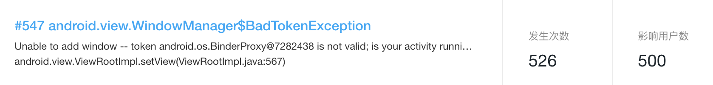
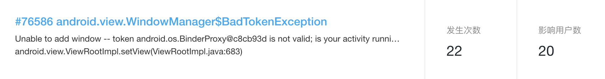
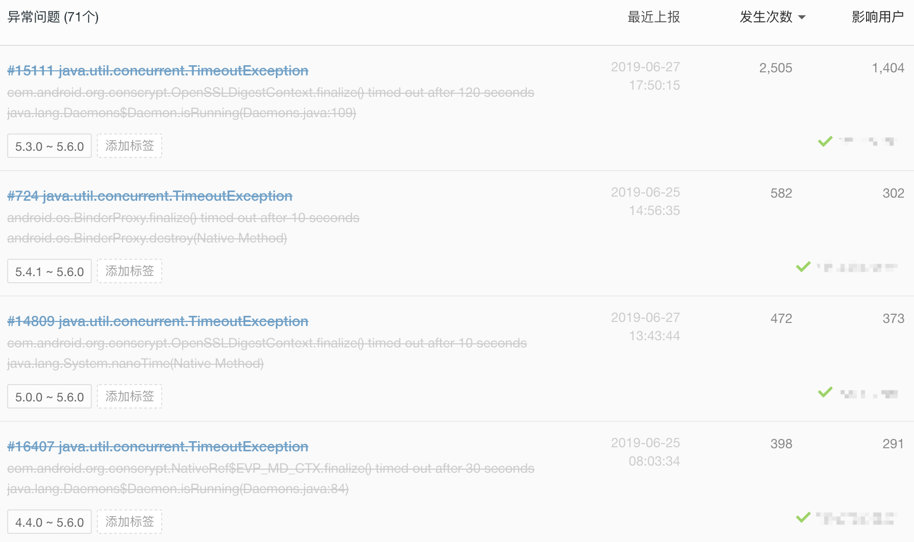
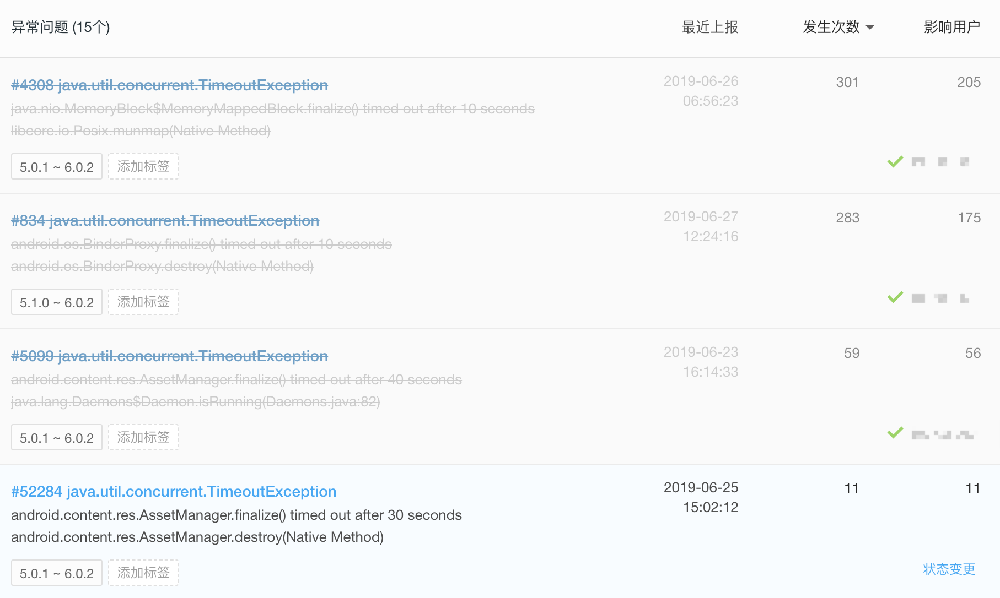

# AndroidCompat
兼容处理Android系统相关的问题

## 依赖

[](https://www.apache.org/licenses/LICENSE-2.0)
[ ](https://bintray.com/a-liya/maven/android-compat/_latestVersion)
[](https://android-arsenal.com/api?level=14)

```
implementation 'com.aliya:android-compat:0.0.1'
```

## 1. 修复 Toast WindowManager$BadTokenException 异常

```
异常log：

    android.view.WindowManager$BadTokenException: Unable to add window -- token android.os.BinderProxy@420183e is not valid; is your activity running?
        at android.view.ViewRootImpl.setView(ViewRootImpl.java:679)
        at android.view.WindowManagerGlobal.addView(WindowManagerGlobal.java:342)
        at android.view.WindowManagerImpl.addView(WindowManagerImpl.java:93)
        at android.widget.Toast$TN.handleShow(Toast.java:459)
        at android.widget.Toast$TN$2.handleMessage(Toast.java:342)
        at android.os.Handler.dispatchMessage(Handler.java:102)
        at android.os.Looper.loop(Looper.java:154)
        at android.app.ActivityThread.main(ActivityThread.java:6119)
        at java.lang.reflect.Method.invoke(Native Method)
        at com.android.internal.os.ZygoteInit$MethodAndArgsCaller.run(ZygoteInit.java:886)
        at com.android.internal.os.ZygoteInit.main(ZygoteInit.java:776)
```

Android level 26 (8.0) 官方已修复

```
Android 26 源码：

private static class TN extends ITransientNotification.Stub {
	...
	
	public void handleShow(IBinder windowToken) {
		...
		
		try {
			mWM.addView(mView, mParams);
			trySendAccessibilityEvent();
		} catch (WindowManager.BadTokenException e) {
			/* ignore */
		}
	}
}
```

线上 App Crash 上报数据：



修复方法，替换Context
```
Toast.makeText(ToastContext.compatContext(context), "xxx", Toast.LENGTH_SHORT).show();
```

## 2. 修复 Object#finalize() - java.util.concurrent.TimeoutException 异常


```
异常log：

    java.util.concurrent.TimeoutException: com.android.org.conscrypt.OpenSSLDigestContext.finalize() timed out after 120 seconds
        at com.android.org.conscrypt.NativeCrypto.EVP_MD_CTX_destroy(Native Method)
        at com.android.org.conscrypt.OpenSSLDigestContext.finalize(OpenSSLDigestContext.java:27)
        at java.lang.Daemons$FinalizerDaemon.run(Daemons.java:200)
        at java.lang.Daemons$FinalizerDaemon.run(Daemons.java:200)
        at java.lang.Thread.run(Thread.java:818)
```

线上 App Crash 上报数据：





修复方法：在 Application#onCreate() 调用以下方法

```
    @Override
    public void onCreate() {
        super.onCreate();

        CrashCompat.fixBug(); // 在Crash上报工具之后调用，eg：Bugly init.
    }
```

参考：
[https://juejin.im/entry/5cdc17e5f265da03a54c4198](https://juejin.im/entry/5cdc17e5f265da03a54c4198)